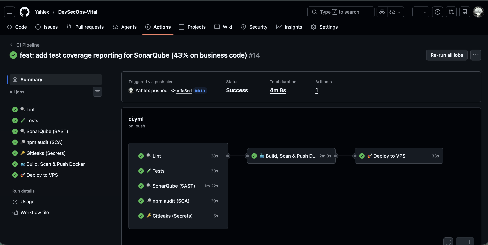
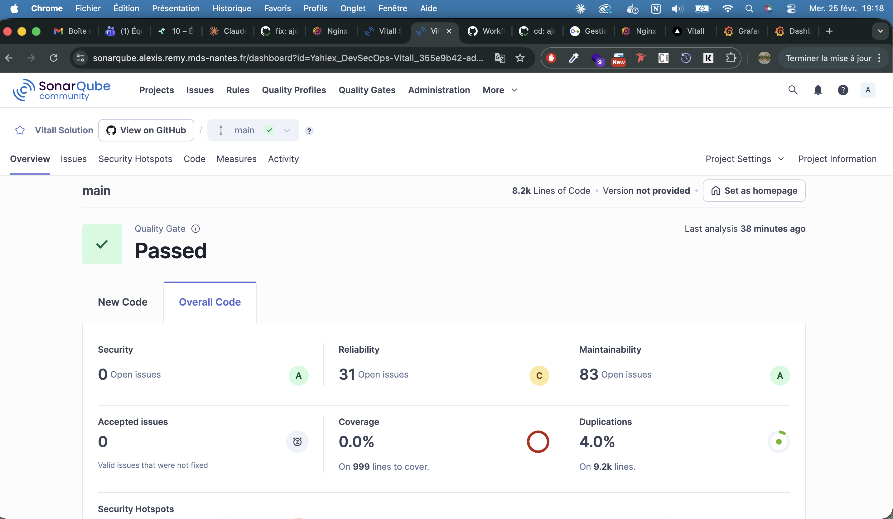
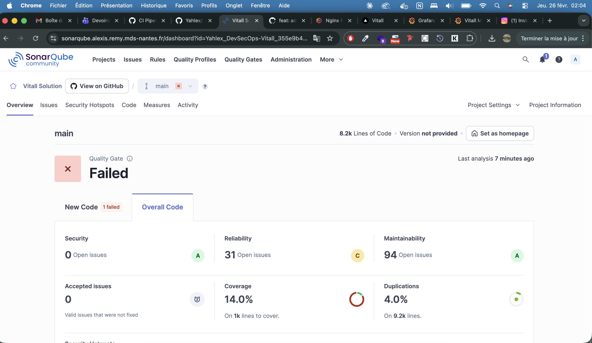
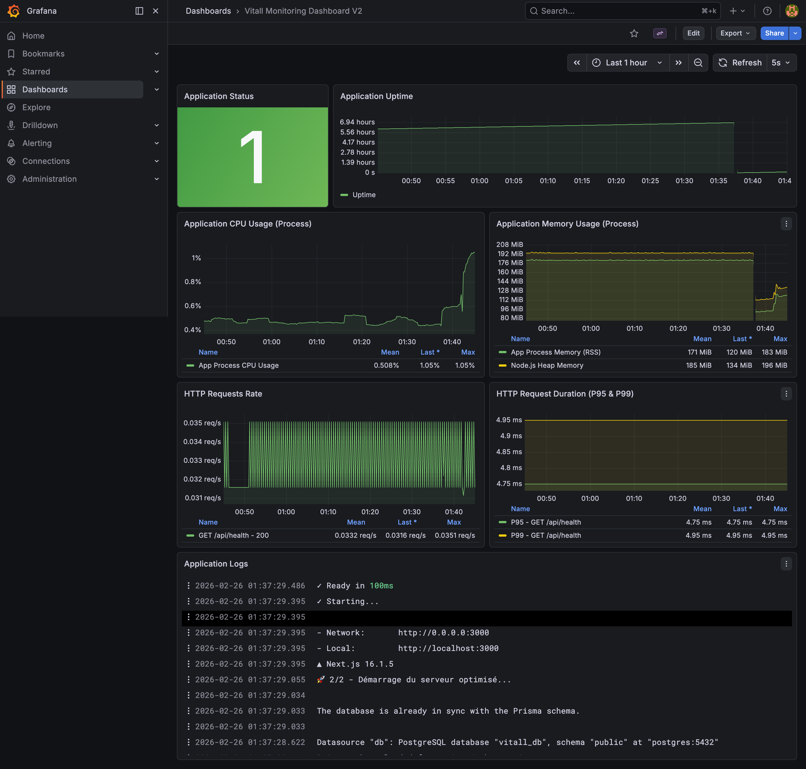
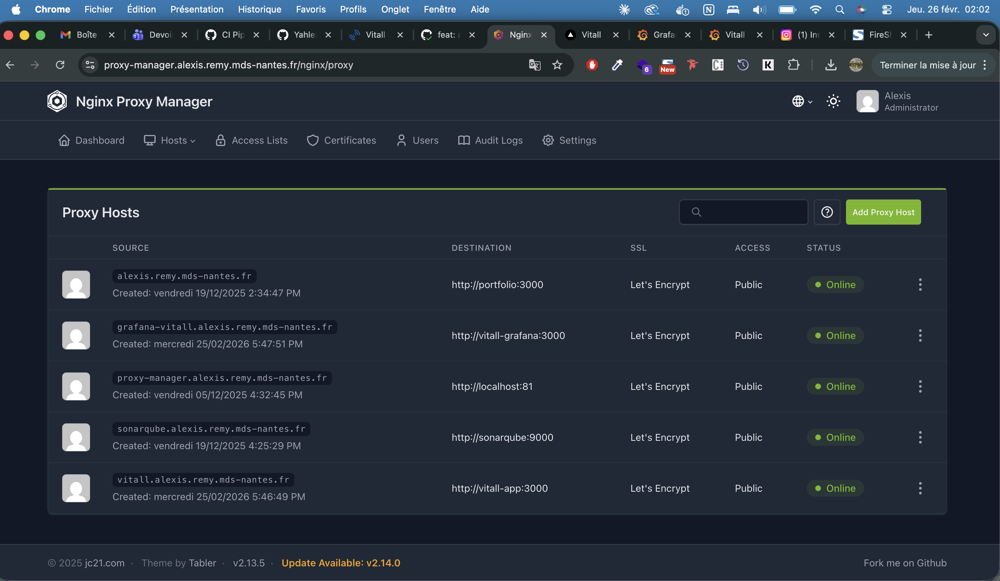

# Preuves de validation

---

Les 7 jobs du pipeline GitHub Actions au vert (lint, test, sonarqube, sca, secrets-scan, build, deploy).

---

Tableau de bord SonarQube — analyse du code (bugs, vulnérabilités, code smells).

---

Couverture de code sur SonarQube (14% global, ~43% sur le code métier hors composants UI).

---

Dashboard Grafana avec les métriques Prometheus et les logs Loki.

---

Nginx Proxy Manager avec les proxy hosts configurés et les certificats SSL Let's Encrypt.
